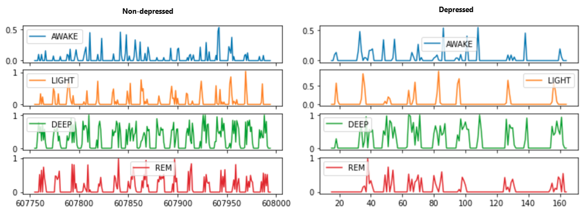

# Predicting depression from FitBit sleep stages with machine learning and deep learning

Capstone research project for the completion of the [Applied Statistical Modelling and Health Informatics MSc](https://www.kcl.ac.uk/study/postgraduate-taught/courses/applied-statistical-modelling-health-informatics) at King's College London.

Project Status: Active

## 🚩 Objective

Based on depression's bi-directional relationship with sleep, this project investigates the classification an individual's depressive status based on sleep stages derived from a wearable device.

## 📌 Key Results

Table showing study design. Four comparisons would be made, which compares the performance of (i) hand-crafted features driven by domain knowledge and (ii) features extracted in an unsupervised manner. The effect of using CNN to explore night-to-night variations of domain-knowledge-driven features would be explored.

Flow diagram showing the preprocessing.

Correlation heatmap of handcrafted summary features

Time series resulting from binning of the original *simple symbolic sequence* into a numeric time series, which is the input to feature extraction by `tsfresh`

Performance of baseline machine learning classifiers (support vector classifier and random forest) of using different datasets, using 5-fold cross validation grouped by subjects.

## 📓 Featured Notebooks/Analysis/Deliverables
- [Project updates](docs/msc_project_updates.pptx)
- More visualisations [here](viz/).

## ⚙️ Methods & Technologies Used
- Time series feature extraction (`tsfresh`)
- Time series classification
- Deep learning (CNN with `tensorflow`)
- Machine learning (`sklearn`, RF, XGBoost, SVM)
- Data visualisation and dashboard (`streamlit`, `matplotlib`, `ggplot`)
- Data wrangling (`pandas`, `tidyverse`)
- Version control (Git)
- Analysis was conducted with Python 3 and R. 

## ✏️ Project Description

**Data source**
- Data was collected as part of the [RADAR-MDD](https://www.researchsquare.com/article/rs-612374/v1) project ([study protocol](https://bmcpsychiatry.biomedcentral.com/track/pdf/10.1186/s12888-019-2049-z.pdf)).
- The FitBit device outputs categorical sleep stage labels every 30 second and only when the person is classified as asleep. The raw data are in the format of categorical sleep stage label in 30-second epochs, where the labels could be one of `AWAKE`, `LIGHT`, `DEEP`, `REM` or `UNKNOWN`.
- Depressive status was self-reported by the subjects in the form of PHQ-8 questionnaires and was binarised to positive (>=10) or otherwise.

**Research questions**
- How does the performance of handcrafted sleep features compare to unsupervised time series feature extraction?
- Can deep learning by CNN improve performance by incorporating nightly changes of handcrafted sleep features, compared to a 14-day aggregate?

**Challenges**
- ***Sequence classification***: The raw sleep stage data comes in the form of a *simple symbolic sequence*. It is cyclical but does not have a fixed period (e.g. cycles later in the night tend to be longer) nor a fixed shape (e.g. unlike a heartbreat ECG). There is no definitive way to represent it numerically.
- ***Hierarchical data***: The data is multilevel in nature, where (i) multiple nights correspond to the 14-day observation period of a single PHQ-test; (ii) multiple PHQ test results came from a single subject; and (iii) multiple subjects were nested within three centres. 
- ***Data quality***: Sleep stages in some nights are missing. The Fitbit is also not the gold standard and only outputs stages when it classifies the subject as asleep.

**Steps taken**
- Literature review revealed options including mathematical models, spectrograms and sequence kernels. The two representations were selected to be (i) summarized into descriptive features (because depression's established impact on them) and (ii) binning into proportions (based on previous work).
- Data partition and cross validation involved grouping by subjects (but not by centres, because EDA showed similar characteristics across centres).
- EDA showed that #nights missing within the 14-day feature window was not related to depressive status nor PHQ-8 score. Missingness within a single night (between FitBit-derived sleep onset and offset) was shown to be trivial.

## 👤 Contributing Members / Project supervisors

- Dr Shaoxiong Sun, KCL (project primary supervisor)
- Prof Richard Dobson, KCL (project secondary supervisor)
- Dr Amos Folarin, KCL (project secondary supervisor)